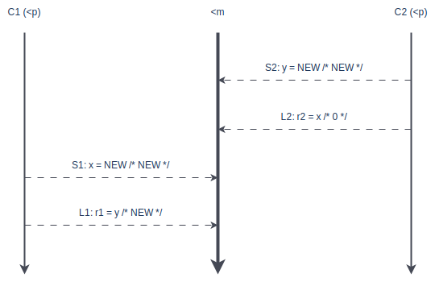

+++
title = '【内存模型】顺序一致性'
series = '内存模型'
date = '2024-05-10'
tags = ['工程实践']
isCJKLanguage = true
+++

本文介绍第一种内存模型 SC，它是最符合直觉的内存模型，也是理解其他模型的基础。

## 介绍
SC 是「Sequential Consistency」的缩写，意思就是「顺序一致性」，后面我们提到它的时候，方便起见，后文均简称为 SC。它是 Leslie Lamport 在 1979 年发表的论文「[How to Make a Multiprocessor Computer That Correctly Executes Multiprocess Programs](https://www.microsoft.com/en-us/research/uploads/prod/2016/12/How-to-Make-a-Multiprocessor-Computer-That-Correctly-Executes-Multiprocess-Programs.pdf)」中提出来的。Leslie Lamport 是一位了不起的计算机科学家，他更广为人知的成就是：一、因为在分布式系统方面的卓越贡献获得了 2013 年的图灵奖；二、LaTex 的作者。

我们来看看 Leslie 是怎么说的：

> … the result of any execution is the same as if the operations of all the processors were executed in some sequential order, and the operations of each individual processor appear in this sequence in the order specified by its program.

这句话够晦涩的，有一种「看不懂，但大受震撼」的感觉。我们来解构一下，有三个要点。

**程序执行是有某种全局顺序的**。注意，这不是说多核上每次执行顺序都一样。

**在这种全局顺序中，每个处理器上的指令的执行顺序，跟单个处理器上程序指定的顺序一致**。比如，在[本系列第一篇文章](posts/memory-model/introduction/)中的例子，`C1`上指定了先执行`S1`，后执行`L1`，那么，无论`C1`和`C2`并行执行最终会产生什么样的全局顺序，在这种全局顺序中，`S1`始终会在`L1`前面，但它们中间可能会插入别的处理器的指令。如果我们没有讲这个例子，那么这听起来就像一句废话，看了这个例子后再来看这句话，会发现它是值得深入思考的。

言下之意，**不同处理器之间的指令顺序，是无法保证的**。也就是说，`S1`和`S2`谁先谁后，是不确定的。

当然，这里既然讨论的是内存模型，那么，这些指令通常是跟操作共享内存有关的指令。如果不同处理器上的指令，不产生其他处理器能看到的效果，那么也就不在我们的讨论范围内了。

SC 这种内存模型，是最符合大多数程序员直觉的。大多数程序员都觉得单核上的执行顺序应该跟程序指定的一样，然后多核之间的执行顺序是无法确定的。

## 场景分析
下面，我们基于上篇文章的伪代码来详细解释 SC：
```c
// Core C1
S1: x = NEW;
L1: r1 = y;
```

```c
// Core C2
S2: y = NEW;
L2: r2 = x;
```

另外，我们要约定一些定义和助记符：

- 程序指定内存操作在单个处理上的执行顺序——Program Order，记为`<p`
- 所有处理器的内存操作在内存中生效的顺序——Memory Order，记为`<m`
- `op1`在 Program Order 早于`op2`发生，记作`op1 <p op2`
- `op1`在 Memory Order 早于`op2`发生，记作`op1 <m op2`

### 场景一
第一个例子的执行如下图：

先来看两个处理器上的 Program Order 的情况：
- 在`C1 <p`上的执行序列是`S1->L1`，也就是说`S1 <p L1`
- 在`C2 <p`上的执行序列是`S2->L2`，也就是说`S2 <p L2`

再来看实际产生的 Memory Order 的情况：
- 最终体现在`<m`中的顺序为`S1->L1->S2->L2`
- 意味着`S1 <m L1`，它和`S1 <p L1`是一致的
- 同时意味着`S2 <m L2`，它和`S2 <p L2`也是一致的

现在我们可以下结论：

场景一是符合 SC 的，运行结果是`(r1, r2)` == `(0, NEW)`


### 场景二
第二个场景的执行如下图：

我们可以得出类似的结论：


场景二是符合 SC 的，运行结果是`(r1, r2)` == `(NEW, 0)`


### 场景三
第三个场景的执行如下图：

在这个例子中，在单个处理器上连续的指令，在实际执行的时候发生了交错（`S1`和`L1`之间隔着`S2`，`S2`和`L2`之间隔着`L1`），这在现实场景中很常见，但是如果我们对照 SC 的特性，依然可以得到以下结论：


场景三是符合 SC 的，运行结果是`(r1, r2)` == `(NEW, NEW)`


### 场景四
最后一个场景的执行如下图：

这个场景就有点不一样了，因为`S2 <p L2`，但是同时`L2 <m S2`，所以我们可以得出结论：

场景四是**不符合 SC** 的，运行结果是`(r1, r2)` == `(0, 0)`


## 形式化定义
经过了这四个执行场景的分析，是时候给 SC 下一个形式化定义了。所谓形式化定义，就是用类似数学符号的语言，做逻辑严密的定义。

- 所有处理器按照它们的`<p`把读（`Load`）写（`Store`）指令插入到`<m`中，不管这些指令是否针对同一内存地址（`a == b` 或 `a != b` 都适用），具体包括四种情况：
  1. 如果 `L(a) <p L(b)`，则 `L(a) <m L(b)`（`Load -> Load`）
  2. 如果 `L(a) <p S(b)`，则 `L(a) <m S(b)`（`Load -> Store`）
  3. 如果 `S(a) <p L(b)`，则 `S(a) <m L(b)`（`Store -> Store`）
  4. 如果 `S(a) <p L(b)`，则 `S(a) <m L(b)`（`Store -> Load`）
- 针对同一内存地址，读（`Load`）总是能得到 `<m` 中最近一次写（`Store`）的值：
```
          L(a) = Max<m { S(a) | S(a) <m L(a) }
```
上面公式的意思是，对地址`a`的`Load`，读到的是在`<m`中最新（Max）的一个对`a`进行`Store`的效果。虽然看起来也像一句废话，但是，在缓存的作用下，这个结果并不是理所当然的。

此外，这里除了`Load`和`Store`，我们要引入第三种读写指令——`RMW`。`RMW`代表`Read->Modify->Write`，它通常用于这样一种场景：基于内存中某个变量的当前值来更新这个变量，比如把某个变量`++`。通常，做这样的操作，需要三个步骤：
1. 把内存的值读到寄存器中；
2. 对寄存器中的值进行运算；
3. 把新的值写回内存。

这三个步骤通常就是三条指令，所以这个过程是可以被打断的，从而产生「条件竞争」。而`RMW`是一类「原子操作」，所谓「原子操作」是指不能再分的操作，它把这三个步骤用一条指令完成了，从而避免了「条件竞争」。我们把`RMW`指令加入考虑，加上`Load`和`Store`，如果这三种指令中任取两个，分别记作`op 1`和`op 2`，且`op1 <p op2`，那么下面表格中的`Yes`就代表了`op1 <m op2`成立的场景（本系列文章中都会采用这种记法，不再赘述）：

|             | Load 2 | Store 2 | RMW 2 |
|:-----------:|:------:|:-------:|:-----:|
| **Load 1**  | Yes    | Yes     | Yes   |
| **Store 1** | Yes    | Yes     | Yes   |
| **RMW 1**   | Yes    | Yes     | Yes   |

当然，我们已经很清楚，对于 SC 这种模型来说，每种组合都是`Yes`。好像没什么特别的，但我们后面会介绍更多的内存模型，都是使用这种分析方法，并以 SC 为参照对比，所以首先理解 SC，是理解其他内存模型的基础。